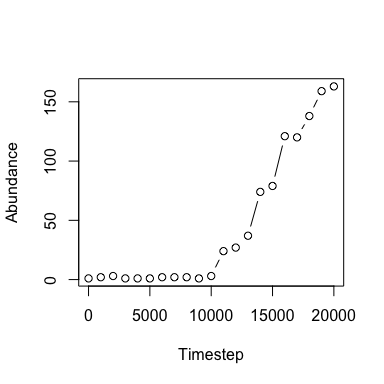

## Installation

    devtools::install_github('role-model/roleLite')

    ## Skipping install of 'roleLite' from a github remote, the SHA1 (70f16615) has not changed since last install.
    ##   Use `force = TRUE` to force installation

    library(roleLite)

## Neutral simulation

Use the `untbSim` function to run a simulation

    neut <- untbSim(J = 1000, # number of individuals in local community
                    Sm = 50, # number of species in meta community
                    Jm = 10000, # number of individuals in meta community
                    nu = 0, # speciation probability
                    m = 0.1, # immigration probability
                    niter = 10000) # number of iteration to run

The output of `untbSim` is a little hard to work with, better to pass it
to `getAbund`

    neutAbund <- getAbund(neut)

    # returns a data.frame, see `?getAbund` for more detials
    head(neutAbund)

    ##   tstep spID abund
    ## 1     0    1   245
    ## 2     0    2   159
    ## 3     0    3   103
    ## 4     0    4    83
    ## 5     0    5    73
    ## 6     0    6    57

## Competitive simulation

We can do the same thing with a competitive model using the `compSim`
function

    S <- 50 # number of species

    # make a competition matrix
    a <- aa <- matrix(runif(S^2, 0, 5), nrow = S)
    diag(aa) <- runif(S, 1, 10)

    # run sim
    comp <- compSim(J = 1000, # number of individuals in local community
                    Sm = S, # number of species in meta community
                    Jm = 10000, # number of individuals in meta community
                    nu = 0, # speciation probability
                    m = 0.1, # immigration probability
                    alpha = a, # competition matrix
                    niter = 10000) # number of iteration to run

    compAbund <- getAbund(comp)
    head(compAbund)

    ##   tstep spID abund
    ## 1     0    1   283
    ## 2     0    2   145
    ## 3     0    3   105
    ## 4     0    4    80
    ## 5     0    5    66
    ## 6     0    6    55

## SAD visualization

We can plot the SAD from the output of the `getAbund` function. Note, by
default this function returns the abundances for all timesteps,
depending on the simulation run, this could be a lot of timesteps! We
typically want to look at the final SAD. We can do that like this:

    finalSADComp <- compAbund$abund[compAbund$tstep == max(compAbund$tstep)]

    plot(sort(finalSADComp, decreasing = TRUE), log = 'y', 
         xlab = 'Rank', ylab = 'Abundance')

We can also look at the timeseries of specific species like this:

    # look at population timeseries for species 10
    sp10 <- compAbund[compAbund$spID == 10, ]

    plot(sp10$tstep, sp10$abund, type = 'b', 
         xlab = 'Time step', ylab = 'Abundance')

## Simulating purturbations

Let’s suppose that the composition of the meta community changes
drastically, say due to invasion. One of the rarest species becomes
hyper abundant. We can simulate that like this for the neutral case

    # parameter set-up
    S <- 50 
    J <- 1000
    nu <- 0
    m <- 0.1
    niter <- 10000

    # make meta SAD outside of `untbSim` so we can manipulate it to reflect 
    # invasion...hang tight, you'll see
    metaSAD <- pika::rlseries(S, 0.001) 

    # run sim pre-invasion
    untbPre <- untbSim(J = J, nu = nu, m = m, niter = niter, initMeta = metaSAD)

Notice when we pass a custom metacommunity SAD to the function we
*don’t* need to additionally specify `Sm` and `Jm`.

Now we can modify the metacommunity SAD so one of least common species
is *twice* as common as the previously most common species

    newMetaSAD <- metaSAD
    irare <- which.min(newMetaSAD)[1] # index of a rare species
    newMetaSAD[irare] <- 2 * max(newMetaSAD)

    # now we can pass this new meta SAD to the sim function, and pass the final 
    # state of the pre-invasion simulation as the initial condition for this sim:
    untbPost <- untbSim(J = J, nu = nu, m = m, niter = niter, 
                        initLocal = untbPre[nrow(untbPre), ], 
                        initMeta = newMetaSAD)

Finally let’s combine the two simulations and see what happened

    abundPre <- getAbund(untbPre)
    abundPost <- getAbund(untbPost)

    # note: first timestep of post is last of pre, so we can discard one
    abundPost <- abundPost[abundPost$tstep != 0, ]

    # update timestep values of post to come *after* pre
    abundPost$tstep <- abundPost$tstep + max(abundPre$tstep)

    # combine
    abundAll <- rbind(abundPre, abundPost)

    # visualize abundance timeseries for invader
    abundInvader <- abundAll[abundAll$spID == irare, ]

    plot(abundInvader$tstep, abundInvader$abund, type = 'b',
         xlab = 'Timestep', ylab = 'Abundance')

If your plot’s x-axis starts at 10,000 it means the species wasn’t even
present in the local community before the invasion.

We could look at the SADs pre and post invasion as well

    plot(sort(abundPre$abund[abundPre$tstep == max(abundPre$tstep)], 
              decreasing = TRUE), 
         log = 'y', 
         xlab = 'Rank', ylab = 'Abundance', main = 'Right before invasion')

    plot(sort(abundPost$abund[abundPost$tstep == 13000], 
              decreasing = TRUE), 
         log = 'y', 
         xlab = 'Rank', ylab = 'Abundance', main = 'Shortly after invasion')

    plot(sort(abundPost$abund[abundPost$tstep == max(abundPost$tstep)], 
              decreasing = TRUE), 
         log = 'y', 
         xlab = 'Rank', ylab = 'Abundance', main = 'Long after invasion')

Shortly after the invasion there is a noticeable change in the shape,
but long after the invasion the shape seems to have settled back down.
